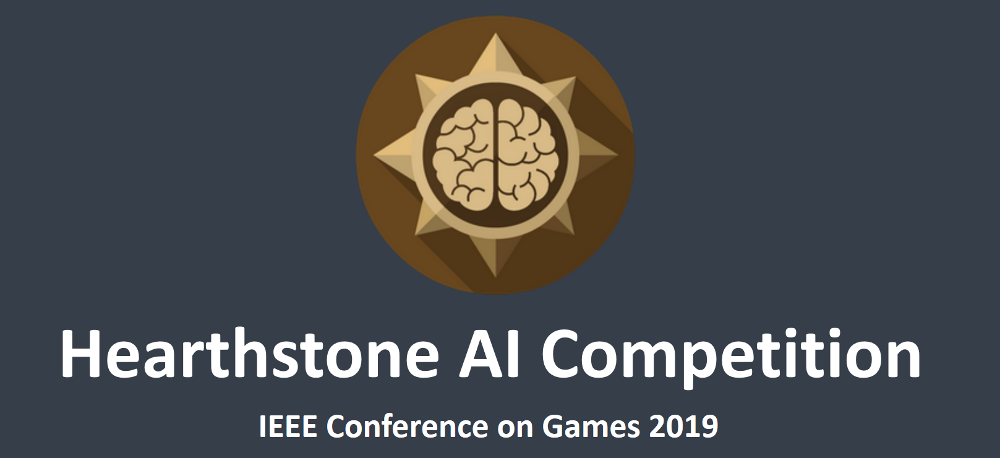

# Hearthstone-AI Comeptition 2019

Welcome to the 2019 Edition of the Hearthstone AI Competition. We are happy to annouce that this competition will be part of the IEEE Conference on Games [Link](http://ieee-cog.org/). More information including sourcecode of previous year's submissions can be found on the official competition homepage [Link](http://www.ci.ovgu.de/Research/HearthstoneAI.html).

# Overview

The collectible online card game Hearthstone features a rich testbed and poses unique demands for generating artificial intelligence agents. The game is a turn-based card game between two opponents, using constructed decks of thirty cards along with a selected hero with a unique power. Players use their limited mana crystals to cast spells or summon minions to attack their opponent, with the goal to reduce the opponent’s health to zero. The competition aims to promote the stepwise development of fully autonomous AI agents in the context of Hearthstone.

Entrants will submit agents to participate in one of the two tracks:

* **Premade Deck Playing”-track:** participants will receive a list of three known decks and three decks unknown prior submission. During evaluation we will simulate all possible matchups for at least 100 games to determine the average win-rate for each agent. Determining and using the characteristics of the player’s and the opponent’s deck to the player’s advantage will help in winning the game. The decks for the premade deck playing track can be found under:
  * Decks.AggroPirateWarrior,
  * Decks.RenoKazakusMage,
  * Decks.MidrangeJadeShaman
  * Three more meta-decks will be used, but will remain unknown to the participants till the final submission deadline.
* **“User Created Deck Playing”-track:** the competition framework allows agents to define their own deck. Finding a deck that can consistently beat a vast amount of other decks will play a key role in this competition track. Additionally, it gives the participants the chance in optimizing the agents’ strategy to the characteristics of their chosen deck.

As long as the number of subsmission remains below 32, we will use a round robin tournament to determine the best submissions based on their average win-rate. In case more agents are submitted we will use multiple smaller round-robin tournaments to determine likely candidates and use a final round robin tournament for determining the best three submissions.

**Competition Entry Deadline: July 15th 2019 23:59 UTC-12**

### Project Structure ###

* **SabberStoneCore** *(.NET Core)*

  Core simulator engine, all the functions needed for the simulator are in here. Check out the Wiki [Link](https://github.com/HearthSim/SabberStone/wiki) for informations about the core and how to use it.

* **SabberStoneCoreTest** *(.NET Core)*

  UnitTest for the simulator, there is a generated test for each card in the current game.

* **SabberStoneCoreConsole** *(.NET Core)*

  A test project to run simple codeline based games to test outcome.

* **SabberStoneCoreAi** *(.NET Core)*

  A test project to run A.I. simulations with predefinied decks and strategys.

* **SabberStoneGui** *(.NET Framework)*

  A test project that shows off a visual implementation of the SimpleAi project. This is probably where beginners should start looking at. There is a simple GUI which allows different decks to play against each other with different strategys. Check out the Wiki [Link](https://github.com/HearthSim/SabberStone/wiki/SabberStoneGui) for informations about the use of SimpleUi.

### Installation

* See the Setup guide on [Link](http://www.ci.ovgu.de/Research/HearthstoneAI.html)

### Documentation

* Competition Website [Link](http://www.ci.ovgu.de/Research/HearthstoneAI.html)
* Wiki [Link](https://github.com/HearthSim/SabberStone/wiki)
* SabberStoneCoreAi [Link](https://github.com/HearthSim/SabberStone/tree/master/SabberStoneCoreAi)
* SabberStoneCoreGui [Link](https://github.com/HearthSim/SabberStone/wiki/SabberStoneGui)

### License

SabberStone is licensed under the terms of the
[Affero GPLv3](https://www.gnu.org/licenses/agpl-3.0.en.html) or any later version.

### Community
SabberStone is being developed by darkfriend77 (darkfriend@swissonline.ch) and rnilva
* SabberStone on [Discord](https://discord.gg/my9WTwK) .. come and talk with us!
* SabberStone on [Reddit](https://redd.it/5p0ar8)
* SabberStone is a [HearthSim](http://hearthsim.info) project!
